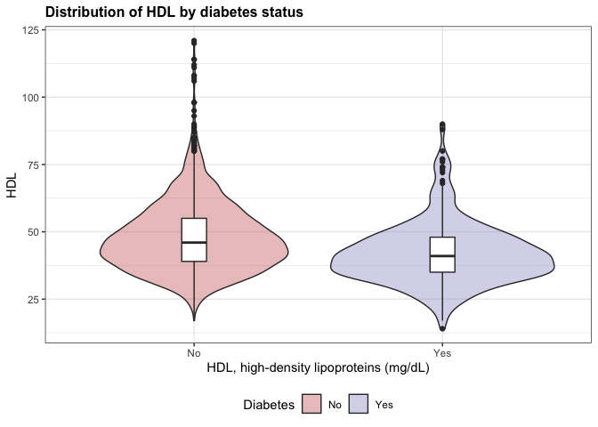
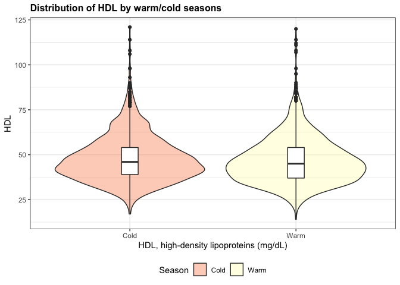
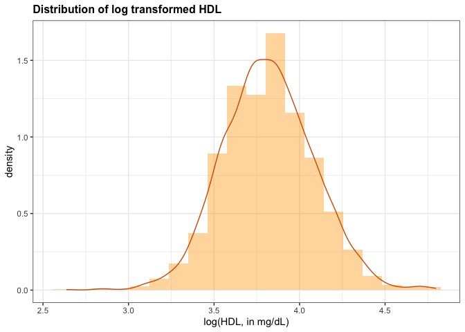
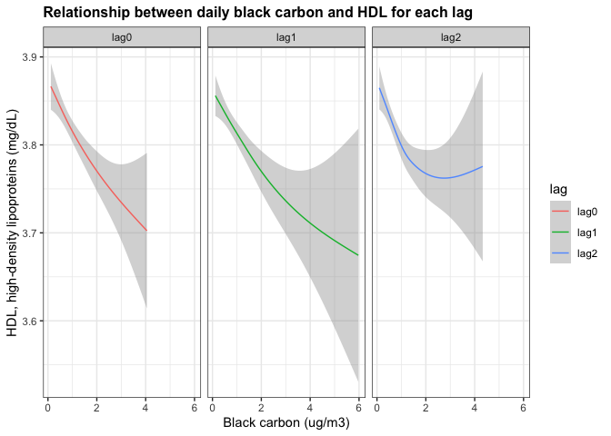
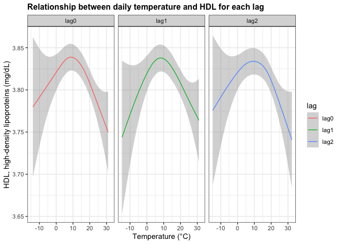

PM566_Midterm
================
Yuhong Hu
2022-10-23

# Introduction

## Background

High-density lipoprotein (HDL) cholesterol is known as the ‘good’
cholesterol because it helps remove other forms of cholesterol from your
bloodstream. Higher levels of HDL cholesterol are associated with a
lower risk of heart disease.

Air pollution is known to be one of the leading causes of cardiovascular
disease. Emerging evidence suggests that particulate-mediated HDL
(high-density lipoprotein) dysfunction might be a novel mechanism
linking air pollution exposure to adverse cardiovascular
effects.However, few studies have evaluated the impact of
traffic-related air pollution exposure (black carbon, nitrogen dioxide).
Similarly, temperature has been linked to cardiovascular disease, but
little is known about the underlying mechanisms.

## Research objectives and questions

Given the background, the project investigated the association between
acute exposure to ambient black carbon (one source of traffic-related
air pollution) and ambient temperature and HDL level. Additionally, to
account for potential latency in HDL level changes, the project also
assessed the association between 1-day and 2-day lag exposure and HDL
level. Furthermore, the project also explored the effect modification by
diabetes status, which known to cause HDL dysfunction.

By visualization and modeling, **the project aimed to address the
following questions**.

1.  Is daily ambient black carbon associated with HDL level? Is there
    lag effect for the association of interest?\*\*

2.  Is daily ambient temperature associated with HDL level? Is there lag
    effect for the association of interest?\*\*

3.  Does diabetes status modify the association between daily ambient
    black carbon/temperature and HDL level?\*\*

4.  What are potential ‘risk factors’ of HDL changes among study
    population?

# Method

## Dataset and study population

For data disclosure issue,the project was based on part of the Veterans
Administration Normative Aging Study (NAS), which could be used for
class. NAS was a longitudinal study established in 1963, the study
enrolled 2,280 men from the Greater Boston area, who were aged between
21 to 80 and were determined to be free of known chronic medical
conditions by an initial health screening. Participants visited the
study center repeatedly for physical examinations, blood pressure
measurements, blood sample collection, and questionnaires approximately
every four years. Blood samples were used for lipid analysis.

During the follow-up period, black carbon (BC) was measured at a central
monitoring site located on the roof of Countway Library, Harvard Medical
School, in Boston, MA, temperature was also collected. Single day lags
were computed for these pollutants and meteorological variables from the
same day of health visits and up to 2 days before the visit.

**The key variables were as followed.**

-   `ID`: subject ID

-   `DATE`: date as an integer (origin = 1/1/1960)

-   `VISIT`: visit number

-   `YEAR`: year

-   `WARMCOLD`: Warm/Cold season (1=warm, 0=cold)

-   `WKDAY`: day of the week

-   `HDL`: high-density lipoproteins

-   `AGE`: age in years

-   `RACE`: Race (1=white, 2=black, 3 = hispanic white, 4 = hispanic
    black, 5=american indian)

-   `DIABETE`: Physician-diagnosed DM (0=no, 1=yes)

-   `BMI`: Body Mass Index (kg/m2)

-   `SMK`:Cigarette smoking status (1=never, 3=current, 4=former)

-   `HT`: hypertension (1=yes, 0=no)

-   `STATIN`: Taking statin medication at that visit? (0=no, 1=yes)

-   `BC24H`: Black carbon level on the same day of each visit

-   `BCD1`: Black carbon level on the previous 1 day of each visit

-   `BCD2`: Black carbon level on the previous 2 days of each visit

-   `TEMPC24H`: Ambient temperature on the same day of each visit

-   `TMPCD1`: Ambient temperature on the previous 1 day (lag 1) of each
    visit

-   `TMPCD2`: Ambient temperature on the previous two days (lag 2) of
    each visit

## Exploratory data analyses

``` r
# Set working directory and load data
setwd("~/Desktop/PhD course/pm 566/pm566_midterm")
nas_hdl <- readRDS("nas_hdl.rds")

# Look at the dimension of the dataset and check the missing values/implausible values
str(nas_hdl)
length(unique(nas_hdl$ID))
skim(nas_hdl)

#Exclude missing values and double check the final dataset
nas <- na.omit(nas_hdl)
length(unique(nas$ID))
skim(nas)
summary(nas$YEAR)
```

The dataset included a subset of 981 subjects with a total of 2483
observations. As NAS dataset was well-curated, so the dataset was pretty
clean and less subject to missing data issue. For total of 31 variable,
`RACE` had 29 missing observations, and `NEDUC` had 1 missing value. By
looking at the summary statistics of each variable, we did not observe
any implausible value for continuous variable or wrongly-coded value for
categorical variable. Therefore, we simply excluded the observations
with missing observations, as the missing data issue here is trivial.
The final main dataset had 968 subjects with a total of 2453
observations from 1995 to 2011.

## Data wrangling and transformation

-   We first create a new categorical variable `hdlcat` to divide the
    HDL level into three categories based on clinical recommendation.
    For easy plotting and modeling, we also level and label the
    categorical variable. For tabling summary statistics, we created
    label for key variables.

``` r
# create a vis variable to indicate the visit sequence for each subject for plotting and descriptive statistics
# nas <- nas %>% 
#   arrange(ID,VISIT) %>% 
#   group_by(ID) %>% 
#   mutate(vis = row_number()) %>% 
#   ungroup()

# Level and label the categorical variable for plotting
nas <- nas %>% 
  mutate(hdlcat = factor(case_when(HDL>60~3,(HDL>=40&HDL<=60)~2,HDL<40~1),
                         levels = c(1,2,3),
                         labels=c('At risk (<40)','Normal (40-60)','High (>60)')))

nas <- nas %>% 
  mutate(WARMCOLD = factor(WARMCOLD,levels = c(0,1),labels = c('Cold','Warm')),
         DIABETE = factor(DIABETE,levels = c(0,1),labels = c('No','Yes')),
         STATIN = factor(STATIN,levels = c(0,1),labels = c('No','Yes')),
         HT = factor(HT,levels = c(0,1),labels = c('No','Yes')),
         RACE = factor(RACE,levels = c(1,2,3,4,5),labels = c('White','Black','Hispanic White','Hispanic Black','American Indian')),
         SMK = factor(SMK,levels = c(1,3,4),labels = c('Never','Current','Former'))
         )

# Label variable
label(nas$WARMCOLD) <- 'SEASON'
label(nas$STATIN) <- 'STATIN USE'
label(nas$SMK) <- 'SMOKING STATUS'
label(nas$BC24H) <- 'SAME DAY BLACK CARBON (ug/m3)'
label(nas$TEMPC24H) <- 'SAME DAY TEMPERATURE (°C)'
label(nas$AGE) <- 'AGE (years)'
label(nas$BMI) <- 'BMI (kg/m2)'
```

-   In one of the result section, we would like to show the univariate
    association of interest by black carbon/temperature on the same day
    of each visit (`lag0`), black carbon/temperature on the previous 1
    day of each visit (`lag1`), black carbon/temperature on the previous
    2 days of each visit (`lag2`). However, the lag exposure measures
    were storaged in ‘wide’ format, thus, we transformed the ‘wide’
    dataset into ‘long’ dataset for easy plotting.

-   The ambient black carbon and temperature exposure were the same for
    subjects who took hospital vist on the same day, thus, we had
    duplicates of the two exposure in the dataset. To plot time series
    of temperature and black carbon during following, we created dataset
    without duplicates for variables `BC24H` and `TEMPC24H`.

-   Last but not least, the dataset produced without further usage was
    removed to keep environment tidy.

``` r
# Create long format dataset
nas_long1 <- gather(nas, lag, BC, BC24H:BCD2)

nas_long1 <- nas_long1 %>% 
  mutate(lag = case_when(lag=='BC24H'~'lag0',lag=='BCD1'~'lag1',lag=='BCD2'~'lag2'))

nas_long2 <- gather(nas, lag, Temp, TEMPC24H:TMPCD2)

nas_long2 <- nas_long2 %>% 
  mutate(lag = case_when(lag=='TEMPC24H'~'lag0',lag=='TMPCD1'~'lag1',lag=='TMPCD2'~'lag2'))

nas_long <- merge(nas_long1,nas_long2,sort=TRUE)

nas_long <- nas_long %>% 
  mutate(DIABETE = factor(DIABETE,levels = c(0,1),labels = c('No','Yes')))

# Create dataset without duplicate exposure
nas$date <- as.Date(nas$DATE,origin='1960-01-01')

nas_BC <- nas %>% 
  distinct(date,BC24H)

nas_TM <- nas %>% 
  distinct(date,TEMPC24H)

# clean the unnecesary dataset
rm(nas_long1)
rm(nas_long2)
```

## Tools for data exploration

-   The packages used for EDA: skimr.

-   The packages used for data wrangling and transformation: dplyr,
    tidyr.

-   The packages used for visulization: ggplot2, ggpubr, table1,
    kableExtra, dotwhisker, ggeffects, sjPlot.

-   The packages used for linear mixed effect model: nlme, broom.mixed.

# Preliminary results

## Temporal trends of HDL, daily ambient black carbon and daily ambient temperatuer during follow-up

-   We did not observe a temporal trend or seasonal pattern of
    population HDL level.

-   In general, the ambient black carbon level has decrease during
    follow-up, from 1995 to 2011, as expected.

-   Regular seasonal flutuation was observed for ambient temperature
    during follow-up, as expected.

``` r
nas %>% 
  group_by(date) %>% 
  summarise(HDL=mean(HDL)) %>% 
  ggplot(aes(x=date, y=HDL))+
  geom_line(aes(x=date, y=HDL),color='#9999CC')+
  labs(title = "Temporal trends of daily average HDL level among participants", x  = "Date", y = "HDL, high-density lipoproteins (mg/dL)")+
  theme_bw() +
  theme(
    plot.title = element_text(face = "bold", size = 12))
```

<!-- -->

``` r
nas_BC %>% 
  ggplot(aes(x=date, y=BC24H))+
  geom_line(color='#0066CC')+
  labs(title = "Temporal trends of daily black carbon among participants", x  = "Date", y = "Black carbon (ug/m3)")+
  theme_bw() +
  theme(
    plot.title = element_text(face = "bold", size = 12))
```

<!-- -->

``` r
nas_TM %>% 
  ggplot(aes(x=date, y=TEMPC24H))+
  geom_line(color="#66CC99")+
  labs(title = "Temporal trends of daily temperature among participants", x  = "Date", y = "Temperature (°C)")+
  theme_bw() +
  theme(
    plot.title = element_text(face = "bold", size = 12))
```

<!-- -->

## Descriptive statistics

According to clinical suggestion, males with less than 40 mg/dL HDL was
at risk of cardiovascular disease, HDL of 60 mg/dL HDL or above was
desirable for males. Males with HDL level fall between 40-60 mg/dL are
considered in normal condition. The table showed the basic summary
statistics of key variables by the three levels of HDL.

``` r
table1(~AGE+BMI+RACE+STATIN+DIABETE+WARMCOLD+SMK+BC24H+TEMPC24H|hdlcat,data=nas)%>% 
  kable(caption = "Summary Statistics of population by HDL level") %>% 
  kable_styling()
```

<table class="table" style="margin-left: auto; margin-right: auto;">
<caption>
Summary Statistics of population by HDL level
</caption>
<thead>
<tr>
<th style="text-align:left;">
 
</th>
<th style="text-align:left;">
At risk (\<40)
</th>
<th style="text-align:left;">
Normal (40-60)
</th>
<th style="text-align:left;">
High (\>60)
</th>
<th style="text-align:left;">
Overall
</th>
</tr>
</thead>
<tbody>
<tr>
<td style="text-align:left;">
</td>
<td style="text-align:left;">
(N=729)
</td>
<td style="text-align:left;">
(N=1380)
</td>
<td style="text-align:left;">
(N=344)
</td>
<td style="text-align:left;">
(N=2453)
</td>
</tr>
<tr>
<td style="text-align:left;">
AGE (years)
</td>
<td style="text-align:left;">
</td>
<td style="text-align:left;">
</td>
<td style="text-align:left;">
</td>
<td style="text-align:left;">
</td>
</tr>
<tr>
<td style="text-align:left;">
  Mean (SD)
</td>
<td style="text-align:left;">
71.7 (7.64)
</td>
<td style="text-align:left;">
73.2 (7.26)
</td>
<td style="text-align:left;">
73.8 (7.48)
</td>
<td style="text-align:left;">
72.9 (7.44)
</td>
</tr>
<tr>
<td style="text-align:left;">
  Median \[Min, Max\]
</td>
<td style="text-align:left;">
72.0 \[51.0, 96.0\]
</td>
<td style="text-align:left;">
73.0 \[49.0, 97.0\]
</td>
<td style="text-align:left;">
74.0 \[57.0, 97.0\]
</td>
<td style="text-align:left;">
73.0 \[49.0, 97.0\]
</td>
</tr>
<tr>
<td style="text-align:left;">
BMI (kg/m2)
</td>
<td style="text-align:left;">
</td>
<td style="text-align:left;">
</td>
<td style="text-align:left;">
</td>
<td style="text-align:left;">
</td>
</tr>
<tr>
<td style="text-align:left;">
  Mean (SD)
</td>
<td style="text-align:left;">
29.3 (4.49)
</td>
<td style="text-align:left;">
27.6 (3.64)
</td>
<td style="text-align:left;">
26.2 (3.30)
</td>
<td style="text-align:left;">
27.9 (4.00)
</td>
</tr>
<tr>
<td style="text-align:left;">
  Median \[Min, Max\]
</td>
<td style="text-align:left;">
28.5 \[19.4, 52.6\]
</td>
<td style="text-align:left;">
27.3 \[16.7, 43.9\]
</td>
<td style="text-align:left;">
26.0 \[17.2, 38.5\]
</td>
<td style="text-align:left;">
27.4 \[16.7, 52.6\]
</td>
</tr>
<tr>
<td style="text-align:left;">
RACE
</td>
<td style="text-align:left;">
</td>
<td style="text-align:left;">
</td>
<td style="text-align:left;">
</td>
<td style="text-align:left;">
</td>
</tr>
<tr>
<td style="text-align:left;">
  White
</td>
<td style="text-align:left;">
722 (99.0%)
</td>
<td style="text-align:left;">
1345 (97.5%)
</td>
<td style="text-align:left;">
332 (96.5%)
</td>
<td style="text-align:left;">
2399 (97.8%)
</td>
</tr>
<tr>
<td style="text-align:left;">
  Black
</td>
<td style="text-align:left;">
4 (0.5%)
</td>
<td style="text-align:left;">
22 (1.6%)
</td>
<td style="text-align:left;">
11 (3.2%)
</td>
<td style="text-align:left;">
37 (1.5%)
</td>
</tr>
<tr>
<td style="text-align:left;">
  Hispanic White
</td>
<td style="text-align:left;">
3 (0.4%)
</td>
<td style="text-align:left;">
9 (0.7%)
</td>
<td style="text-align:left;">
1 (0.3%)
</td>
<td style="text-align:left;">
13 (0.5%)
</td>
</tr>
<tr>
<td style="text-align:left;">
  Hispanic Black
</td>
<td style="text-align:left;">
0 (0%)
</td>
<td style="text-align:left;">
4 (0.3%)
</td>
<td style="text-align:left;">
0 (0%)
</td>
<td style="text-align:left;">
4 (0.2%)
</td>
</tr>
<tr>
<td style="text-align:left;">
  American Indian
</td>
<td style="text-align:left;">
0 (0%)
</td>
<td style="text-align:left;">
0 (0%)
</td>
<td style="text-align:left;">
0 (0%)
</td>
<td style="text-align:left;">
0 (0%)
</td>
</tr>
<tr>
<td style="text-align:left;">
STATIN USE
</td>
<td style="text-align:left;">
</td>
<td style="text-align:left;">
</td>
<td style="text-align:left;">
</td>
<td style="text-align:left;">
</td>
</tr>
<tr>
<td style="text-align:left;">
  No
</td>
<td style="text-align:left;">
448 (61.5%)
</td>
<td style="text-align:left;">
795 (57.6%)
</td>
<td style="text-align:left;">
246 (71.5%)
</td>
<td style="text-align:left;">
1489 (60.7%)
</td>
</tr>
<tr>
<td style="text-align:left;">
  Yes
</td>
<td style="text-align:left;">
281 (38.5%)
</td>
<td style="text-align:left;">
585 (42.4%)
</td>
<td style="text-align:left;">
98 (28.5%)
</td>
<td style="text-align:left;">
964 (39.3%)
</td>
</tr>
<tr>
<td style="text-align:left;">
DIABETE
</td>
<td style="text-align:left;">
</td>
<td style="text-align:left;">
</td>
<td style="text-align:left;">
</td>
<td style="text-align:left;">
</td>
</tr>
<tr>
<td style="text-align:left;">
  No
</td>
<td style="text-align:left;">
578 (79.3%)
</td>
<td style="text-align:left;">
1220 (88.4%)
</td>
<td style="text-align:left;">
320 (93.0%)
</td>
<td style="text-align:left;">
2118 (86.3%)
</td>
</tr>
<tr>
<td style="text-align:left;">
  Yes
</td>
<td style="text-align:left;">
151 (20.7%)
</td>
<td style="text-align:left;">
160 (11.6%)
</td>
<td style="text-align:left;">
24 (7.0%)
</td>
<td style="text-align:left;">
335 (13.7%)
</td>
</tr>
<tr>
<td style="text-align:left;">
SEASON
</td>
<td style="text-align:left;">
</td>
<td style="text-align:left;">
</td>
<td style="text-align:left;">
</td>
<td style="text-align:left;">
</td>
</tr>
<tr>
<td style="text-align:left;">
  Cold
</td>
<td style="text-align:left;">
287 (39.4%)
</td>
<td style="text-align:left;">
618 (44.8%)
</td>
<td style="text-align:left;">
157 (45.6%)
</td>
<td style="text-align:left;">
1062 (43.3%)
</td>
</tr>
<tr>
<td style="text-align:left;">
  Warm
</td>
<td style="text-align:left;">
442 (60.6%)
</td>
<td style="text-align:left;">
762 (55.2%)
</td>
<td style="text-align:left;">
187 (54.4%)
</td>
<td style="text-align:left;">
1391 (56.7%)
</td>
</tr>
<tr>
<td style="text-align:left;">
SMOKING STATUS
</td>
<td style="text-align:left;">
</td>
<td style="text-align:left;">
</td>
<td style="text-align:left;">
</td>
<td style="text-align:left;">
</td>
</tr>
<tr>
<td style="text-align:left;">
  Never
</td>
<td style="text-align:left;">
209 (28.7%)
</td>
<td style="text-align:left;">
419 (30.4%)
</td>
<td style="text-align:left;">
100 (29.1%)
</td>
<td style="text-align:left;">
728 (29.7%)
</td>
</tr>
<tr>
<td style="text-align:left;">
  Current
</td>
<td style="text-align:left;">
26 (3.6%)
</td>
<td style="text-align:left;">
58 (4.2%)
</td>
<td style="text-align:left;">
13 (3.8%)
</td>
<td style="text-align:left;">
97 (4.0%)
</td>
</tr>
<tr>
<td style="text-align:left;">
  Former
</td>
<td style="text-align:left;">
494 (67.8%)
</td>
<td style="text-align:left;">
903 (65.4%)
</td>
<td style="text-align:left;">
231 (67.2%)
</td>
<td style="text-align:left;">
1628 (66.4%)
</td>
</tr>
<tr>
<td style="text-align:left;">
SAME DAY BLACK CARBON (ug/m3)
</td>
<td style="text-align:left;">
</td>
<td style="text-align:left;">
</td>
<td style="text-align:left;">
</td>
<td style="text-align:left;">
</td>
</tr>
<tr>
<td style="text-align:left;">
  Mean (SD)
</td>
<td style="text-align:left;">
1.08 (0.636)
</td>
<td style="text-align:left;">
0.968 (0.562)
</td>
<td style="text-align:left;">
0.908 (0.509)
</td>
<td style="text-align:left;">
0.993 (0.581)
</td>
</tr>
<tr>
<td style="text-align:left;">
  Median \[Min, Max\]
</td>
<td style="text-align:left;">
0.953 \[0.119, 4.05\]
</td>
<td style="text-align:left;">
0.830 \[0.202, 3.56\]
</td>
<td style="text-align:left;">
0.808 \[0.180, 2.86\]
</td>
<td style="text-align:left;">
0.854 \[0.119, 4.05\]
</td>
</tr>
<tr>
<td style="text-align:left;">
SAME DAY TEMPERATURE (°C)
</td>
<td style="text-align:left;">
</td>
<td style="text-align:left;">
</td>
<td style="text-align:left;">
</td>
<td style="text-align:left;">
</td>
</tr>
<tr>
<td style="text-align:left;">
  Mean (SD)
</td>
<td style="text-align:left;">
13.3 (9.14)
</td>
<td style="text-align:left;">
12.6 (8.64)
</td>
<td style="text-align:left;">
12.4 (8.15)
</td>
<td style="text-align:left;">
12.8 (8.73)
</td>
</tr>
<tr>
<td style="text-align:left;">
  Median \[Min, Max\]
</td>
<td style="text-align:left;">
14.0 \[-11.4, 31.0\]
</td>
<td style="text-align:left;">
12.8 \[-13.9, 31.0\]
</td>
<td style="text-align:left;">
12.7 \[-13.9, 29.6\]
</td>
<td style="text-align:left;">
13.3 \[-13.9, 31.0\]
</td>
</tr>
</tbody>
</table>

## Distribution of HDL by different levels of risk factors

To further explore whether some demographic and physiological variables
were associated with HDL levels, we displayed violin plot (categorical
variables) and scatterplot (continuous variables) to show the
distribution of HDL by different levels of potential risk factors, and
to identify risk factors of HDL among NAS population.

-   For categorical variables, the different shapes of violin were
    observed for different levels of `STATIN`, `DIABETE`, `RACE`.

-   For continuous variables, `AGE` was slightly significantly
    associated with HDL, and `BMI` was moderately significantly
    associated with HDL.

``` r
#risk factor of HDL-statin
nas %>%
  ggplot(aes(y=HDL,x=STATIN,fill=STATIN))+
  geom_violin(alpha=0.4)+
  geom_boxplot(width=0.1, fill="white")+
  labs(title="Distribution of HDL by statin use",
       x = "HDL, high-density lipoproteins (mg/dL)",
       fill = "Statin use")+
  theme_bw() +
  theme(
    plot.title = element_text(face = "bold", size = 12),
    legend.position="bottom")+
  scale_fill_brewer(palette="Spectral")
```

<!-- -->

``` r
#risk factor of HDL-diabetes
nas %>%
  ggplot(aes(y=HDL,x=DIABETE,fill=DIABETE))+
  geom_violin(alpha=0.4)+
  geom_boxplot(width=0.1, fill="white")+
  labs(title="Distribution of HDL by diabetes status",
       x = "HDL, high-density lipoproteins (mg/dL)",
       fill = "Diabetes")+
  theme_bw() +
  theme(
    plot.title = element_text(face = "bold", size = 12),
    legend.position="bottom")+
  scale_fill_manual(values=c("#CC6666", "#9999CC"))
```

<!-- -->

``` r
#risk factor of HDL-race
nas %>%
  ggplot(aes(y=HDL,x=RACE,fill=RACE))+
  geom_violin(alpha=0.4)+
  geom_boxplot(width=0.1, fill="white")+
  labs(title="Distribution of HDL by Race",
       x = "HDL, high-density lipoproteins (mg/dL)",
       fill = "RACE")+
  theme_bw() +
  theme(
    plot.title = element_text(face = "bold", size = 12),
    legend.position="bottom")+
  scale_fill_brewer(palette="Spectral")
```

<!-- -->

``` r
#risk factor of HDL-season
nas %>%
  ggplot(aes(y=HDL,x=WARMCOLD,fill=WARMCOLD))+
  geom_violin(alpha=0.4)+
  geom_boxplot(width=0.1, fill="white")+
  labs(title="Distribution of HDL by warm/cold seasons",
       x = "HDL, high-density lipoproteins (mg/dL)",
       fill = "Season")+
  theme_bw() +
  theme(
    plot.title = element_text(face = "bold", size = 12),
    legend.position="bottom")+
  scale_fill_brewer(palette="Spectral")
```

<!-- -->

``` r
#risk factor of HDL-SMK
nas %>%
  ggplot(aes(y=HDL,x = SMK,fill=SMK))+
  geom_violin(alpha=0.4)+
  geom_boxplot(width=0.1, fill="white")+
  labs(title="Distribution of HDL by smoking status",
       x = "HDL, high-density lipoproteins (mg/dL)",
       fill = "Smoking")+
  theme_bw() +
  theme(
    plot.title = element_text(face = "bold", size = 12),
    legend.position="bottom")+
  scale_fill_manual(values=c("#CC6666", "#9999CC", "#66CC99"))
```

<!-- -->

``` r
#risk factor of HDL-HT
nas %>%
  ggplot(aes(y=HDL,x =HT,fill=HT))+
  geom_violin(alpha=0.4)+
  geom_boxplot(width=0.1, fill="white")+
  labs(title="Distribution of HDL by hypertension status",
       x = "HDL, high-density lipoproteins (mg/dL)",
       fill = "Hypertension")+
  theme_bw() +
  theme(
    plot.title = element_text(face = "bold", size = 12),
    legend.position="bottom")+
  scale_fill_brewer(palette="Spectral")
```

<!-- -->

``` r
nas %>%
  ggplot(aes(y=HDL,x=WKDAY,fill=WKDAY))+
  geom_violin(alpha=0.4)+
  geom_boxplot(width=0.1, fill="white")+
  labs(title="Distribution of HDL by week of days",
       x = "HDL, high-density lipoproteins (mg/dL)",
       fill = "Week of days")+
  theme_bw() +
  theme(
    plot.title = element_text(face = "bold", size = 12),
    legend.position="bottom")+
  scale_fill_brewer(palette="Spectral")
```

<!-- -->

``` r
#risk factor of HDL-age
nas %>%
  ggplot(aes(x=AGE,y=HDL))+
  geom_point(size=0.5,alpha=0.3,color='#66CC99')+
  geom_smooth(method = lm,color='#336633')+
  stat_cor(method = "pearson", label.x = 80, label.y = 15)+
  labs(title="Correlation between HDL and age",
        x ="Age (years)  ", y = "HDL, high-density lipoproteins (mg/dL)") +
  theme_bw() +
  theme(
    plot.title = element_text(face = "bold", size = 12))
```

<!-- -->

``` r
#risk factor of HDL-BMI
nas %>%
  ggplot(aes(x=BMI,y=HDL))+
  geom_point(size=0.5,alpha=0.3,color='#CC6666')+
  geom_smooth(method = lm,color='#D55E00')+
  stat_cor(method = "pearson", label.x = 40, label.y = 15)+
  labs(title="Correlation between HDL and BMI",
        x ="BMI (kg/m2)  ", y = "HDL, high-density lipoproteins (mg/dL)") +
  theme_bw() +
  theme(
    plot.title = element_text(face = "bold", size = 12))
```

<!-- -->

## Univariate relationship between daily (lag) ambient black carbon, temperature and HDL

Before plotting, we checked the distribution of HDL, and found the
normality was achieved by log transformation of HDL.Therefore, for the
following analyses, we used log(HDL) as outcome measure.

``` r
nas %>% 
  ggplot() + 
  geom_histogram(aes(x=HDL, y=..density..), fill="#66CC99", alpha=0.4,bins=20) + 
  geom_density(aes(x=HDL),color = '#336633',alpha=0.4)+
  labs(title = "Distribution of HDL", x  = "HDL (mg/dL)")+
  theme_bw() +
  theme(
    plot.title = element_text(face = "bold", size = 12))
```

<!-- -->

``` r
nas %>% 
  ggplot() + 
  geom_histogram(aes(x=log(HDL), y=..density..), fill="orange", alpha=0.4,bins=20) + 
  geom_density(aes(x=log(HDL)),color = '#D55E00',alpha=0.4)+
  labs(title = "Distribution of log transformed HDL ", x  = "log(HDL, in mg/dL)")+
  theme_bw() +
  theme(
    plot.title = element_text(face = "bold", size = 12))
```

<!-- -->

-   For black carbon, same day black carbon (lag0) , previous day black
    carbon (lag1), and previous two days black carbon (lag2) seemed to
    inversely associated with HDL level.

-   For temperature, lag0, lag1, and lag2 positively associated with HDL
    for relatively low temperature, whereas negatively associated with
    HDL for relatively high temperature.

``` r
# Relationship between black carbon and HDL for each lag
nas_long %>% 
  ggplot()+
  # geom_point(aes(x=BC,y=log(HDL),color=lag),size=0.2,alpha=0.6)+
  geom_smooth(aes(x=BC,y=log(HDL),color=lag),size = 0.5)+
  facet_wrap(~lag)+
  labs(title = "Relationship between daily black carbon and HDL for each lag ", x  = "Black carbon (ug/m3)", y = "HDL, high-density lipoproteins (mg/dL)",color='lag')+
  theme_bw() +
  theme(
    plot.title = element_text(face = "bold", size = 12))
```

<!-- -->

``` r
# Relationship between temperature and HDL for each lag
nas_long %>% 
  ggplot()+
  # geom_point(aes(x=Temp,y=log(HDL),color=lag),size=0.2,alpha=0.6)+
  geom_smooth(aes(x=Temp,y=log(HDL),color=lag),size = 0.5)+
  facet_wrap(~lag)+
  labs(title = "Relationship between daily temperature and HDL for each lag ", x  = "Temperature (°C)", y = "HDL, high-density lipoproteins (mg/dL)")+
  theme_bw() +
  theme(
    plot.title = element_text(face = "bold", size = 12))
```

<!-- -->

## Effect and lag effect of daily ambient black carbon, temperature on HDL

For further exploration of adjusted association of interest, we
performed linear mixed effect model with the simplest distributed lag
structure (simultaneous adjustment), to account for correlation between
repeated measure and lag effects. For parsimony, we simply adjusted for
covariates that we identified as major risk factors in the NAS
population in the previous section.

### Effect and lag effect of daily ambient black carbon and mofication by diabetes

Significant effect and lag effects of black carbon level on HDL level
were observed. For each lag, black carbon level was inversely associated
with HDL. The decrease in HDL was more likely to be associated with the
ambient black carbon level on the day of visit compared with the black
carbon level on the days before the visits.

``` r
mod1 <- lme(log(HDL)~BC24H+ BCD1 + BCD2 + DIABETE + RACE+STATIN + AGE + BMI,random = ~ 1|ID,data=nas)

#summary(mod1)

summary(mod1)$tTable[2:4,-3] %>% 
  kable() %>% 
  kable_styling()
```

<table class="table" style="margin-left: auto; margin-right: auto;">
<thead>
<tr>
<th style="text-align:left;">
</th>
<th style="text-align:right;">
Value
</th>
<th style="text-align:right;">
Std.Error
</th>
<th style="text-align:right;">
t-value
</th>
<th style="text-align:right;">
p-value
</th>
</tr>
</thead>
<tbody>
<tr>
<td style="text-align:left;">
BC24H
</td>
<td style="text-align:right;">
-0.0271123
</td>
<td style="text-align:right;">
0.0071104
</td>
<td style="text-align:right;">
-3.813071
</td>
<td style="text-align:right;">
0.0001429
</td>
</tr>
<tr>
<td style="text-align:left;">
BCD1
</td>
<td style="text-align:right;">
-0.0185845
</td>
<td style="text-align:right;">
0.0073608
</td>
<td style="text-align:right;">
-2.524792
</td>
<td style="text-align:right;">
0.0116806
</td>
</tr>
<tr>
<td style="text-align:left;">
BCD2
</td>
<td style="text-align:right;">
-0.0207110
</td>
<td style="text-align:right;">
0.0069974
</td>
<td style="text-align:right;">
-2.959813
</td>
<td style="text-align:right;">
0.0031273
</td>
</tr>
</tbody>
</table>

``` r
## lag plots for BC
lag_plot <- tidy(mod1,effects = "fixed")[2:4,]
lag_plot$term <- factor(c("Lag 0", "Lag 1", "Lag 2"), levels=c("Lag 0", "Lag 1", "Lag 2"))


dwplot(lag_plot) +  
  geom_vline(xintercept=0, color="darkgray", linetype=2) + 
  coord_flip() + 
  scale_y_discrete(limits=(levels(lag_plot$term))) + 
  scale_color_manual(values="#0066CC") +  
  ggtitle('The lag effects of black carbon on log(HDL in mg/dL)') +  labs(y = 'Black carbon', x= "Coefficient")+
  theme_bw() +
  theme(
    plot.title = element_text(face = "bold", size = 12),
    legend.position='none')
```


To examine the potential effect modification, an interaction term
between diabetes and same-day black carbon was added into the model. No
statistically significant modification for the association between the
same-day black carbon and HDL by diabetes was observed. However, a
visual representation of these effects showed that there were some
qualitative differences between diabetics and non-diabetics.

``` r
mod1.1 <- lme(log(HDL)~BC24H+ BCD1 + BCD2 + DIABETE + RACE+STATIN + AGE + BMI + DIABETE*BC24H,random = ~ 1|ID,data=nas)
intx1 <- cbind("Model" = "Interaction:diabetes*black carbon", "Variable"= "DIABETE*BC24H", t(as.matrix(round(summary(mod1.1)$tTable[12,-3],3))))

kbl(intx1) %>% kable_styling()
```

<table class="table" style="margin-left: auto; margin-right: auto;">
<thead>
<tr>
<th style="text-align:left;">
Model
</th>
<th style="text-align:left;">
Variable
</th>
<th style="text-align:left;">
Value
</th>
<th style="text-align:left;">
Std.Error
</th>
<th style="text-align:left;">
t-value
</th>
<th style="text-align:left;">
p-value
</th>
</tr>
</thead>
<tbody>
<tr>
<td style="text-align:left;">
Interaction:diabetes\*black carbon
</td>
<td style="text-align:left;">
DIABETE\*BC24H
</td>
<td style="text-align:left;">
-0.027
</td>
<td style="text-align:left;">
0.02
</td>
<td style="text-align:left;">
-1.337
</td>
<td style="text-align:left;">
0.181
</td>
</tr>
</tbody>
</table>

``` r
## plotting interaction
plot_model(mod1.1, type = "pred", terms = c("BC24H", "DIABETE")) + 
  labs(title = 'Predicted values of HDL on black carbon by diabetes status',y = "HDL (mg/dL)", x= bquote('Black carbon'~(mu*g/m^3))) +
  theme_bw() +
  theme(
    plot.title = element_text(face = "bold", size = 12))
```


Neither of the lag ambient temperature were significant predictors of
the outcome. Linear effect might mask the curvature relationship.

``` r
mod2 <- lme(log(HDL)~TEMPC24H+ TMPCD1 + TMPCD2 + DIABETE + STATIN + RACE+ AGE + BMI,random = ~ 1|ID,data=nas)

#summary(mod2)

summary(mod2)$tTable[2:4,-3] %>% 
  kable() %>% 
  kable_styling()
```

<table class="table" style="margin-left: auto; margin-right: auto;">
<thead>
<tr>
<th style="text-align:left;">
</th>
<th style="text-align:right;">
Value
</th>
<th style="text-align:right;">
Std.Error
</th>
<th style="text-align:right;">
t-value
</th>
<th style="text-align:right;">
p-value
</th>
</tr>
</thead>
<tbody>
<tr>
<td style="text-align:left;">
TEMPC24H
</td>
<td style="text-align:right;">
-0.0013909
</td>
<td style="text-align:right;">
0.0010084
</td>
<td style="text-align:right;">
-1.3792982
</td>
<td style="text-align:right;">
0.1680115
</td>
</tr>
<tr>
<td style="text-align:left;">
TMPCD1
</td>
<td style="text-align:right;">
-0.0001248
</td>
<td style="text-align:right;">
0.0013790
</td>
<td style="text-align:right;">
-0.0905062
</td>
<td style="text-align:right;">
0.9278972
</td>
</tr>
<tr>
<td style="text-align:left;">
TMPCD2
</td>
<td style="text-align:right;">
-0.0003733
</td>
<td style="text-align:right;">
0.0010409
</td>
<td style="text-align:right;">
-0.3586537
</td>
<td style="text-align:right;">
0.7199054
</td>
</tr>
</tbody>
</table>

``` r
## lag plots for BC
lag_plot2 <- tidy(mod2,effects = "fixed")[2:4,]
lag_plot2$term <- factor(c("Lag 0", "Lag 1", "Lag 2"), levels=c("Lag 0", "Lag 1", "Lag 2"))


dwplot(lag_plot2) +  
  geom_vline(xintercept=0, color="darkgray", linetype=2) + 
  coord_flip() + 
  scale_y_discrete(limits=(levels(lag_plot2$term))) + 
  scale_color_manual(values="#66CC99") +  
  ggtitle('The lag effects of black carbon on log(HDL in mg/dL)') +  labs(y = 'Temperature', x= "Coefficient")+
  theme_bw() +
  theme(
    plot.title = element_text(face = "bold", size = 12),
    legend.position='none')
```


No statistical significant modification for the association between the
same-day temperature and HDL by diabetes was observed. However, a visual
representation of these effects showed that there were some qualitative
differences between diabetics and non-diabetics, though the confidence
interval largely overlapped.

``` r
mod1.2 <- lme(log(HDL)~TEMPC24H+ TMPCD1 + TMPCD2 + DIABETE + STATIN + RACE+ AGE + BMI+ DIABETE*TEMPC24H,random = ~ 1|ID,data=nas)

intx2 <- cbind("Model" = "Interaction: diabetes*temperature", "Variable"= "DIABETE*TEMPC24H", t(as.matrix(round(summary(mod1.2)$tTable[12,-3],3))))

kbl(intx2) %>% kable_styling()
```

<table class="table" style="margin-left: auto; margin-right: auto;">
<thead>
<tr>
<th style="text-align:left;">
Model
</th>
<th style="text-align:left;">
Variable
</th>
<th style="text-align:left;">
Value
</th>
<th style="text-align:left;">
Std.Error
</th>
<th style="text-align:left;">
t-value
</th>
<th style="text-align:left;">
p-value
</th>
</tr>
</thead>
<tbody>
<tr>
<td style="text-align:left;">
Interaction: diabetes\*temperature
</td>
<td style="text-align:left;">
DIABETE\*TEMPC24H
</td>
<td style="text-align:left;">
-0.001
</td>
<td style="text-align:left;">
0.001
</td>
<td style="text-align:left;">
-1.184
</td>
<td style="text-align:left;">
0.237
</td>
</tr>
</tbody>
</table>

``` r
## plotting interaction
plot_model(mod1.2, type = "pred", terms = c("TEMPC24H", "DIABETE")) + 
  labs(title = 'Predicted values of HDL on temperature by diabetes status',y = "HDL (mg/dL)", x= 'Temperature (°C)') +
  theme_bw() +
  theme(
    plot.title = element_text(face = "bold", size = 12))
```


# Conclusion

For temperature, same-day and lagged exposure was positively associated
with HDL for relatively low temperature, whereas negatively associated
with HDL for relatively high temperature, though no significant linear
effect of same-day or lagged exposure on HDL levels were observed. In
contrast, we found inverse association between same-day and lagged
exposure of ambient black carbon and HDL levels, this was further
supported by the result of linear mixed effect model where we did detect
a significant effect of same-day black carbon and its two lags on HDL.
Furthermore, diabetes seemed to modify the association between ambient
black carbon and HDL levels, and the magnitude of the negative
association was larger in diabetes group, despite the non-significant
interaction term was detected using linear mixed effect model.
